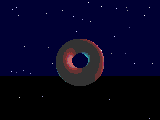
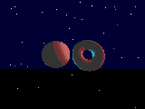

# Aurora3D ✦

A real-time 3D engine that runs **entirely in your terminal** — with zero
dependencies. Just the Python standard library.

It renders solid, shaded 3D objects with a z-buffer, two orbiting colored
lights, a truecolor output, and a twinkling starfield. It can load Wavefront
`.obj` models, turn text into chunky 3D letters, show two shapes at once, and
export everything to a seamless looping **GIF** — using a GIF89a + LZW encoder
written from scratch (still no dependencies).




## Features

- **Solid 3D shading** — per-pixel surface normals, diffuse + specular lighting
- **Z-buffer** — correct hidden-surface removal, so shapes look genuinely solid
- **Two colored light sources** (warm + cool) orbiting the scene
- **24-bit truecolor** with hue cycling (plus a `--no-color` ASCII fallback)
- **Parallax twinkling starfield** background
- **Built-in shapes**: torus, sphere, cube, ripple plane
- **Load any `.obj` model** and render it as a solid point cloud
- **3D text** from a built-in 5×7 font, extruded into blocks
- **Two shapes at once**, sharing one z-buffer so they occlude correctly
- **Animated GIF export** with a seamless loop (from-scratch GIF89a/LZW encoder)
- **Interactive orbit camera** and live controls
- Cross-platform: enables ANSI + UTF-8 on Windows, raw keyboard on POSIX

## Requirements

Python 3.9+ — nothing else.

## Usage

```bash
python aurora.py                       # interactive demo (torus)
python aurora.py --shape sphere        # start on a specific built-in shape
python aurora.py --text "AURORA 3D"    # render extruded 3D text
python aurora.py --obj model.obj       # load & render an .obj model
python aurora.py --dual                # two shapes at once, orbiting
python aurora.py --no-color            # luminance-only ASCII fallback
```

### Export a looping GIF

```bash
python aurora.py --gif out.gif
python aurora.py --text "HELLO" --gif logo.gif
python aurora.py --obj model.obj --dual --gif duo.gif
python aurora.py --gif big.gif --gif-size 480x320 --gif-frames 90 --gif-fps 25
```

The loop is seamless: every rotation, the light orbit, and the color cycle
complete a whole number of turns over the length of the GIF.

## Controls (interactive)

| key | action | | key | action |
|---|---|---|---|---|
| `space` / `n` | next shape | | `w` `a` `d` `x` | orbit the camera |
| `2` | toggle two-shape mode | | `p` | pause / resume spin |
| `c` | cycle light colors | | `r` | recenter camera |
| `l` | freeze / orbit the light | | `+` / `-` | spin faster / slower |
| `s` | toggle starfield | | `q` | quit (Ctrl-C works too) |

## How it works

A shared rasterizer fills a single z-buffer from any number of objects, each
with its own rotation matrix and world offset. The same code path drives the
terminal (2:1 character cells), the GIF exporter (square pixels), and the
two-shape mode — so lighting and occlusion are identical everywhere.

The GIF exporter renders each frame to a pixel buffer, quantizes it to a
216-color cube palette, and packs it with a hand-written LZW coder into a
standards-compliant GIF89a (validated against Pillow and web browsers).

## License

MIT
